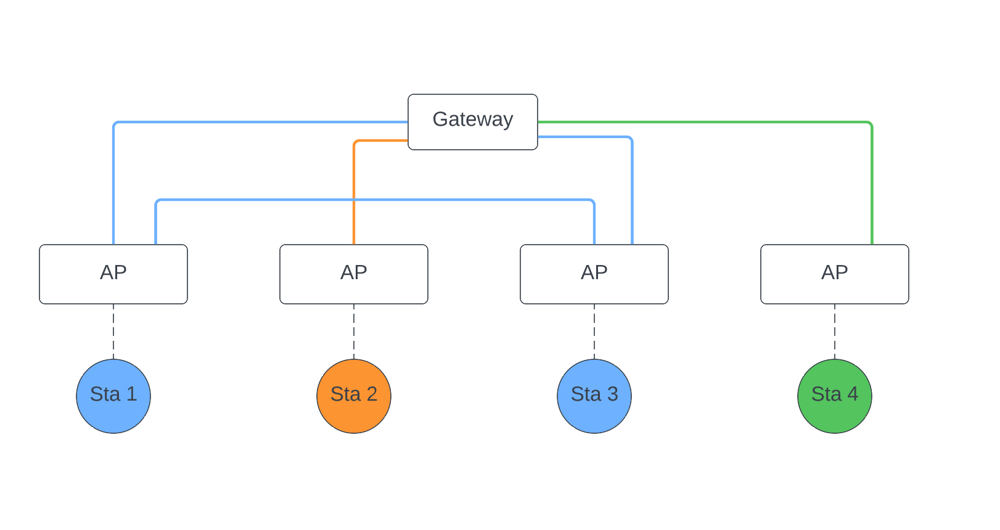
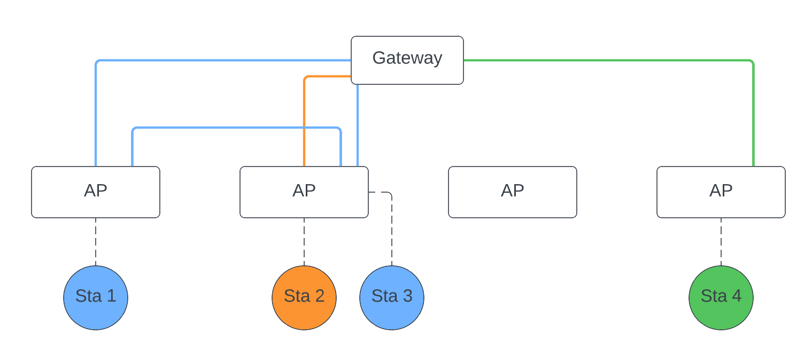
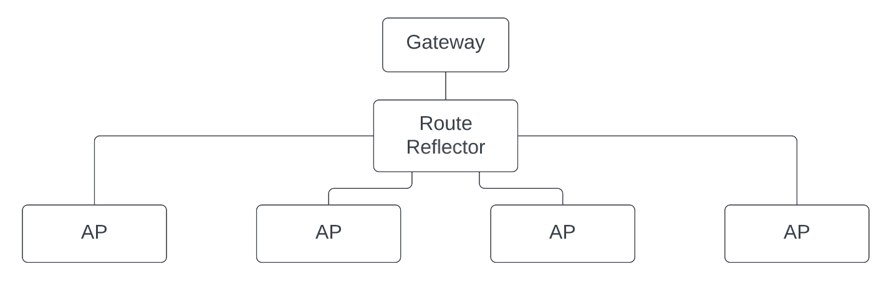

# Architecture

### Overview

As in a regular Wi&#8209;Fi environment, there are **stations** which are connected to **access points**.
WiMoVE partitions the stations into **overlay networks** which work like regular L2 domains:

- Inside of each overlay network, there is working L2 unicast, multicast and broadcast
- There is no connectivity between different overlay networks

The overlay networks are terminated at the access points so that WiMoVE is transparent for the stations.

There is one **gateway** that serves as IP Next Hop in all overlay networks, providing Internet access and L3 connectivity to other overlay networks.
Central network functions like DHCP/DNS servers can also be deployed there.

As a control plane, we use BGP EVPN.
For more efficient route distribution, there is one **route reflectors** which peers with the gateway and all Access Points.
It should be possible to use BGP topologies without a central route reflector or with multiple route reflectors, but we haven't tested them yet.

### Assigning Stations to Overlay Networks

A station's overlay network is determined based on its MAC address.
This has the advantage that the decision can be made locally on each access point without requiring further communication.
In regular WPA2-PSK deployments, the security situation is not changed significantly through this assignment scheme.

An advanced feature set could include an optional central service that is reponsible for assigning stations to overlay networks.
This would offer more granular control over the assignment, e.g. for access control.
There, authentication should not only be performed on a station's MAC address, but a proper authentication protocol like WPA2-EAP should be used.

### Example

Let's assume that there are four access points and four connected stations which are partitioned into three overlay networks.
Every station is connected to a different access point.
The access points can be in different L2 domains, only requiring L3 connectivity.

Drawing each overlay L2 domain and its stations in different colors, we get the following overlay network structure:

Let us now assume that Sta3 roams from the third to the second AP.
Then, the overlay L2 domains change to look like the following diagram:

We can also create a diagram of BGP peerings where the black lines are iBGP peerings:

### Further Information

A more in-depth explanation of our design decisions is available in our [design document](Link to desgin document). 
